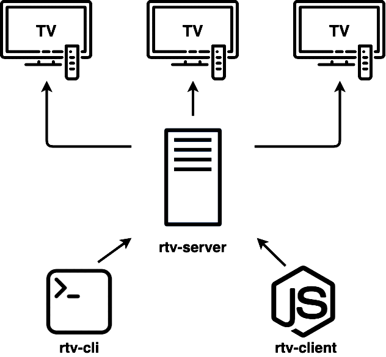
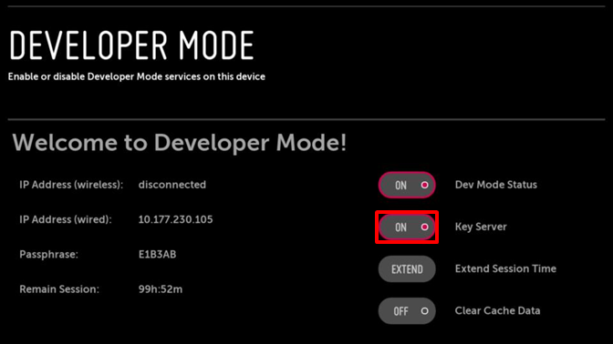

# Remote TV control for developers

Tools for Smart TV developers.



## Supported platforms

- Samsung Tizen
- LG WebOS
- PlayStation4 DevKit/TestKit
- Samsung Orsay 2014+

## Usage

### Run RTV in Docker

The easiest way to run RTV is in a Docker container. It contains the [Samsung Tizen CLI](https://developer.samsung.com/smarttv/develop/getting-started/using-sdk/command-line-interface.html) and [LG webOS CLI](https://webostv.developer.lge.com/sdk/installation/download-installer/).

On Linux:

```bash
   docker run -it \
      -e USER=rtv \
      -e WEBOS_ACCOUNT_LOGIN={your_login} \
      -e WEBOS_ACCOUNT_PASSWORD={your_password} \
      --network=host \
      -v tvdata:/home/developer \
      kinopoisk/rtv
```

On MacOS:

```bash
   docker run -it \
      -e USER=rtv \
      -e WEBOS_ACCOUNT_LOGIN={your_login} \
      -e WEBOS_ACCOUNT_PASSWORD={your_password} \
      -p=3000:3000 \
      -v tvdata:/home/developer \
      kinopoisk/rtv
```

Note: NETWORK_MODE=host allows TVs to scan and wake on LAN, but doesn't work on MacOS.

Note: `WEBOS_ACCOUNT_LOGIN` and `WEBOS_ACCOUNT_PASSWORD` are only required for WebOS TVs.
A login and password can be obtained [here](https://webostv.developer.lge.com/develop/app-test/preparing-account/). These are required for logging in to WebOS Developer Mode app.

### Setup without Docker

1. Install and configure [rtv-server](packages/server/README.md)
2. Run [rtv-ui](packages/ui/README.md)
3. Install and configure [rtv-cli](packages/cli/README.md) if necessary
4. For programmatic usage with Node.JS or Browser JavaScript, install [rtv-client](packages/client/README.md)

## Development

### Development without Docker

1. Install the necessary SDK:
   - [Samsung Tizen CLI](https://developer.samsung.com/smarttv/develop/getting-started/using-sdk/command-line-interface.html)
   - [LG webOS CLI](https://webostv.developer.lge.com/sdk/installation/download-installer/)

2. `nvm use` (use the necessary version of Node.JS in [Node Version Manager](https://github.com/nvm-sh/nvm))

3. Install dependencies:
`npm install`
   `npm run bootstrap`

4. `npm run dev` (builds packages and runs server in watch mode)

#### Development in Docker

1. Install [docker-compose](https://docs.docker.com/compose/install/)
2. Build an image: `npm run docker:build`
3. Run a docker container: `npm run docker:up`
4. Open RTV UI locally: http://localhost:3000

## Release

Releases goes separately to npm and Docker Registry.
Try keep them synced.

#### Release to npm

1. Run tests: `npm t`
2. Bump the version: `npm run release-minor` | `npm run release-patch`
3. Publish to npm: `npm run publish`
4. Push to GitHub: `git push`

#### Release a Docker image

1. Build an image: `npm run docker:build`
2. Run tests in the container: `npm run docker:test`
3. Tag the image: `docker tag rtv:latest kinopoisk/rtv:latest`
4. Push the image to the registry: `IMAGE=kinopoisk/rtv:latest npm run docker:push`

## Adding a new TV

The working computer and the TV must be on the same local network.

#### Adding and configuring Tizen (Samsung)

1. In the RTV UI settings ({YOUR_RTV_SERVER}/settings/tv), manually add your TV (the `New TV` button).
Enter the `IP`, `alias`, and `platform` and save. For example:

    ```
      IP = 192.168.1.66 (TV Settings -> General -> Network -> Network Status -> IP Settings)
      alias = tizentv (or any other name)
      platform = tizen
    ```

2. Specify `Developer IP` on the TV:
    - Open `Apps` (`Applications` on the TV)
    - Press the buttons `1-2-3-4-5` in sequence on the remote control until the input window appears (it may not work the first time)
    - In the window that opens, enable `Developer Mode` (if it isn't enabled yet) and enter the IP address of your rtv-server as the Developer IP
    - Reboot the TV (long press the power button on the remote)

#### Adding and configuring Webos (LG)

1. In the RTV UI settings ({YOUR_RTV_SERVER}/settings/tv), manually add your TV (the `New TV` button).
Enter the `IP`, `alias`, and `platform` and save. For example:

    ```
      IP = 192.168.1.12 (on the TV, usually under Settings -> Connection -> Network -> Wired Connection (or Wi-Fi Connection) -> Advanced Settings)
      alias = webostv (or any other name)
      platform = webos
    ```

2. [Install Developer Mode App](https://webostv.developer.lge.com/develop/app-test/using-devmode-app/#installDevModeApp) on the TV if it isn't installed already.

3. On the RTV UI main screen, select the added TV from the drop-down list and press the `Dev Mode` button if an LG account was specified when starting RTV, or log in manually.

4. Enable `Key Server` in Developer Mode:

   

5. In the settings ({YOUR_RTV_SERVER}/settings/tv) on the TV, copy the `Passphrase` field from the TV screen.

#### Adding and configuring Orsay 2014+ (Legacy Samsung)

1. In the RTV UI settings ({YOUR_RTV_SERVER}/settings/tv), manually add your TV (the `New TV` button).
Enter the `IP`, `alias`, and `platform` and save. For example:

    ```
      IP = 192.168.37.1 (TV Settings -> Network -> Network Status -> IP Settings)
      alias = orsaytv (or any other name)
      platform = orsay
    ```

2. Specify `Developer IP` on the TV:
    - Open `Menu`->`Smart Hub`->`Samsung Account`->`Login`->`Login`
    - In the applications menu (Samsung Apps), long press any application, select `IP Settings`, and enter the IP address of your working computer as the Developer IP

#### Adding and configuring PlayStation4 DevKit/TestKit

   In the RTV UI settings ({YOUR_RTV_SERVER}/settings/tv), manually add your PlayStation (the `New TV` button).
Enter the `IP`, `alias`, and `platform` and save. For example:

    ```
      IP = 192.168.1.66
      alias = ps (or any other name)
      platform = playstation
    ```

#### Adding and running the application

1. In the RTV UI settings ({YOUR_RTV_SERVER}/settings/tv), add your application (the `New App` button):

    ```
    alias=app (or any other name)
    Tizen ID = {TIZEN_ID} (if you have one)
    Webos ID = {WEBOS_ID} (if you have one)
    Orsay ID = {ORSAY_ID} (if you have one)
    PS ID = {PLAYSTATION_ID} (if you have one)
    ```

2. Install the package on the TV. Currently, the easiest way to do this is from the RTV UI:
    - Select the desired TV from the drop-down list
    - Press the `Install` button below and specify the path to the package.

    For Orsay, the installer uploads the package to rtv-server. To download to the TV, you need to sync uploaded applications: in the application menu (Samsung Apps), call the context menu on any application and select `Start User App Sync`. Dev Mode must be running for this item to be available.

    If, when running on Webos, you see an error like "ares-install ERR! ares-install: Error: All configured authentication methods failed",
then you need to re-request the SSH key from the TV with `Key Server` enabled in Developer Mode App. To do this, enable the key server and change the passphrase in the RTV UI settings ({YOUR_RTV_SERVER}/settings/tv) to the wrong one, then back to the correct one.

3. Application launch:
    - Using the `Launch` or `Debug` button in the RTV UI. You can pass launch params as well. You should process these params on the application side.
